# Klasifikasi Buah: Orange vs Grapefruit

## Deskripsi
Proyek ini merupakan implementasi **model klasifikasi** untuk membedakan buah **jeruk (orange)** dan **jeruk bali (grapefruit)** menggunakan tiga algoritma machine learning: **Naive Bayes**, **Decision Tree**, dan **Support Vector Machine (SVM)**. Dataset diambil dari Kaggle: [Oranges vs Grapefruit](https://www.kaggle.com/datasets/joshmcadams/oranges-vs-grapefruit)

---

## Struktur File
```
├── app_nb.py                          # Program Klasifikasi Naive Bayes
├── app_dtree.py                       # Program Klasifikasi Decision Tree
├── app_svm.py                         # Program Klasifikasi SVM
├── citrus.csv                         # Dataset
├── README.md                          # Dokumentasi proyek
└── assets/
    ├── confusion_nb.png               # Confusion Matrix Naive Bayes
    ├── confusion_dtree.png            # Confusion Matrix Decision Tree
    ├── confusion_svm.png              # Confusion Matrix SVM
    ├── precisionRecall_nb.png         # Precision-Recall Curve Naive Bayes
    ├── precisionRecall_dtree.png      # Precision-Recall Curve Decision Tree
    ├── precisionRecall_svm.png        # Precision-Recall Curve SVM
    ├── ROC_nb.png                     # ROC Curve Naive Bayes
    ├── ROC_dtree.png                  # ROC Curve Decision Tree
    ├── ROC_svm.png                    # ROC Curve SVM
    ├── diameter.png                   # Distribusi Diameter
    ├── weight.png                     # Distribusi Weight
    ├── diameterWeight.png             # Scatter Plot Diameter vs Weight
    └── heatmap.png                    # Heatmap Korelasi
```

---

## Dataset
- **Sumber:** Kaggle — Oranges vs Grapefruit
- **Jumlah data:** 10.000 baris
- **Fitur yang digunakan:**
  | Kolom    | Keterangan                        |
  |----------|-----------------------------------|
  | diameter | Diameter buah (inch)              |
  | weight   | Berat buah (gram)                 |
  | red      | Nilai warna merah (RGB)           |
  | green    | Nilai warna hijau (RGB)           |
  | blue     | Nilai warna biru (RGB)            |
- **Label (Target):** `name` → `orange` (1) / `grapefruit` (0)

---

## Tahapan Pembuatan Model

Tahapan berikut diterapkan pada ketiga program (`app_nb.py`, `app_dtree.py`, `app_svm.py`) dengan perbedaan hanya pada algoritma klasifikasi yang digunakan.

---

### 1. Import Library

Mengimpor semua library Python yang dibutuhkan untuk manipulasi data, visualisasi, preprocessing, modeling, dan evaluasi.

**Source Code:**
```python
import pandas as pd
import numpy as np
import matplotlib.pyplot as plt
from matplotlib.colors import ListedColormap
import seaborn as sns
from sklearn.preprocessing import LabelEncoder
from sklearn.preprocessing import StandardScaler
from sklearn.model_selection import train_test_split
from sklearn.naive_bayes import GaussianNB          # Untuk Naive Bayes
from sklearn.tree import DecisionTreeClassifier     # Untuk Decision Tree
from sklearn.svm import SVC                         # Untuk SVM
from sklearn import metrics
from sklearn.metrics import accuracy_score
from sklearn.metrics import classification_report
from sklearn.metrics import precision_recall_curve
from sklearn.metrics import confusion_matrix
from sklearn.metrics import f1_score
```

---

### 2. Load Dataset

Membaca dataset `citrus.csv` menggunakan pandas dan menampilkan 5 baris pertama.

**Source Code:**
```python
df_net = pd.read_csv('citrus.csv')
df_net.head()
```

---

### 3. Eksplorasi Data

Melihat statistik deskriptif dan jumlah data per kelas.

**Source Code:**
```python
# Statistik deskriptif
df_net.describe()

# Jumlah data per kelas
df_net['name'].value_counts()
```

---

### 4. Visualisasi Distribusi Data

#### 4.1 Distribusi Diameter

**Source Code:**
```python
sns.displot(df_net['diameter'])
plt.title('Diameter Distribution')
plt.xlabel('Diameter')
plt.ylabel('Frequency')
plt.show()
```

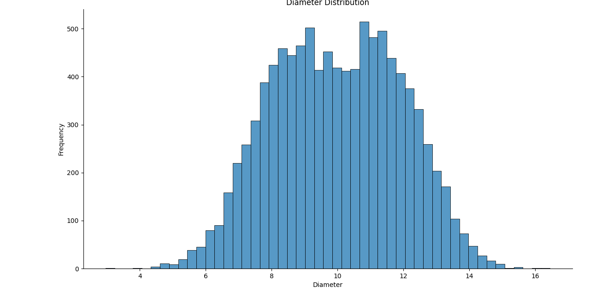

#### 4.2 Distribusi Weight

**Source Code:**
```python
sns.displot(df_net['weight'])
plt.title('Weight Distribution')
plt.xlabel('Weight')
plt.ylabel('Frequency')
plt.show()
```

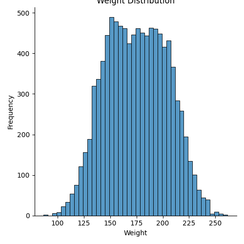

---

### 5. Label Encoding

Mengubah kolom target `name` dari string menjadi numerik. `grapefruit = 0`, `orange = 1`.

**Source Code:**
```python
le = LabelEncoder()
df_net['name'] = le.fit_transform(df_net['name'])
print('Label Encoding results', dict(zip(['grapefruit', 'orange'], le.transform(['grapefruit', 'orange']))))
```

---

### 6. Analisis Korelasi

Membuat correlation matrix dan menampilkannya sebagai heatmap untuk melihat hubungan antar fitur.

**Source Code:**
```python
corr_matrix = df_net.corr()

sns.heatmap(corr_matrix, annot=True, fmt='.2f', cmap='coolwarm')
plt.title('Correlation Heatmap')
plt.tight_layout()
plt.show()
```

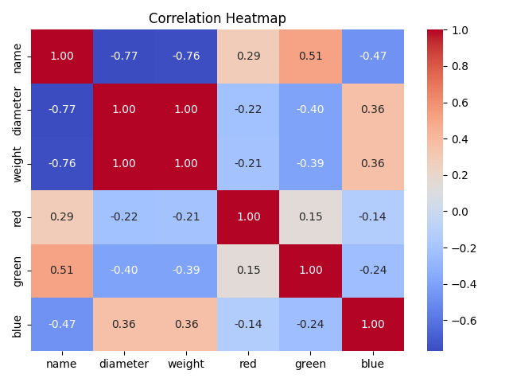

---

### 7. Visualisasi Hubungan Fitur

Menampilkan scatter plot hubungan antara `diameter` dan `weight` berdasarkan kelas.

**Source Code:**
```python
plt.scatter(df_net['diameter'], df_net['weight'], c=df_net['name'], cmap='bwr', alpha=0.4)
plt.xlabel('Diameter')
plt.ylabel('Weight')
plt.title('Relationship between Diameter and Weight')
plt.show()
```

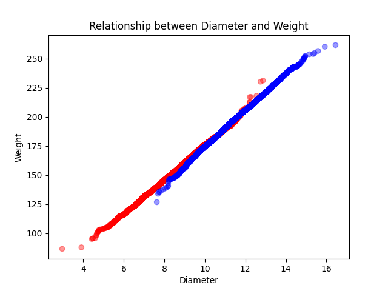

---

### 8. Split Data Menjadi Variabel Independen dan Dependen

Memisahkan fitur (`X`) dan target (`y`).

**Source Code:**
```python
X = df_net[['diameter', 'weight', 'red', 'green', 'blue']].values
y = df_net['name'].values
```

---

### 9. Pembagian Data Training dan Testing

Membagi data menjadi 75% training dan 25% testing dengan `random_state=0`.

**Source Code:**
```python
X_train, X_test, y_train, y_test = train_test_split(X, y, test_size=0.25, random_state=0)

print('Length of X_train:', len(X_train))
print('Length of X_test:', len(X_test))
```

---

### 10. Feature Scaling

Melakukan standardisasi fitur menggunakan `StandardScaler` agar semua fitur memiliki skala yang sama.

**Source Code:**
```python
sc = StandardScaler()
X_train = sc.fit_transform(X_train)
X_test = sc.transform(X_test)
```

---

## Pembuatan Model Klasifikasi

Berikut tahapan training, prediksi, dan evaluasi untuk masing-masing algoritma.

---

### A. Naive Bayes (GaussianNB)

#### 10A. Training Model

**Source Code:**
```python
classifier = GaussianNB()
classifier.fit(X_train, y_train)
```

#### 11A. Prediksi

**Source Code:**
```python
y_pred = classifier.predict(X_test)
print(np.concatenate((y_pred.reshape(len(y_pred), 1), y_test.reshape(len(y_test), 1)), 1))
```

#### 12A. Evaluasi Model

**Source Code:**
```python
# Accuracy
print(f"Accuracy : {accuracy_score(y_test, y_pred)}")

# F1 Score
print(f"F1 Score : {f1_score(y_test, y_pred)}")

# Classification Report
print(f'Classification Report: \n{classification_report(y_test, y_pred)}')
```

#### 13A. Confusion Matrix

**Source Code:**
```python
cf_matrix = confusion_matrix(y_test, y_pred)
sns.heatmap(cf_matrix, annot=True, fmt='d', cmap='Blues')
plt.title('Confusion Matrix')
plt.xlabel('Predicted')
plt.ylabel('Actual')
plt.tight_layout()
plt.show()
```


#### 14A. Precision-Recall Curve

**Source Code:**
```python
y_pred_proba = classifier.predict_proba(X_test)[:,1]
precision, recall, thresholds = precision_recall_curve(y_test, y_pred_proba)

fig, ax = plt.subplots()
ax.plot(recall, precision, label='Naive Bayes')
ax.set_xlabel('Recall')
ax.set_ylabel('Precision')
ax.set_title('Precision-Recall Curve')
ax.legend()
plt.tight_layout()
plt.show()
```

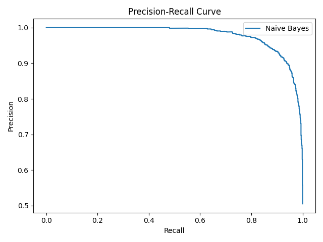

#### 15A. ROC Curve

**Source Code:**
```python
y_pred_proba = classifier.predict_proba(X_test)[:,1]
fpr, tpr, thresholds = metrics.roc_curve(y_test, y_pred_proba)

fig, ax = plt.subplots()
ax.plot(fpr, tpr, label='Naive Bayes Classification', color='firebrick')
ax.set_title('ROC Curve')
ax.set_xlabel('False Positive Rate')
ax.set_ylabel('True Positive Rate')
plt.box(False)
ax.legend()
plt.tight_layout()
plt.show()
```

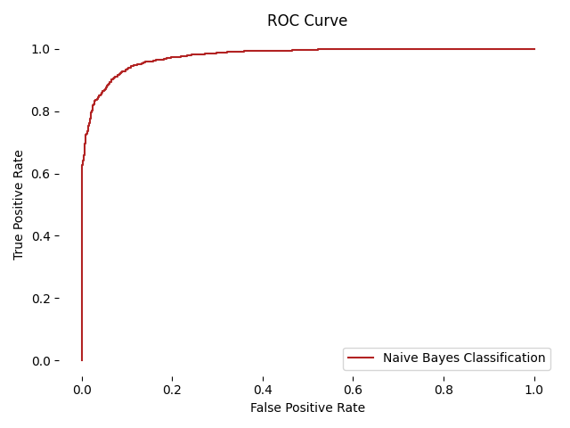

---

### B. Decision Tree

#### 10B. Training Model

**Source Code:**
```python
classifier = DecisionTreeClassifier(criterion='entropy', random_state=0)
classifier.fit(X_train, y_train)
```

#### 11B. Prediksi

**Source Code:**
```python
y_pred = classifier.predict(X_test)
print(np.concatenate((y_pred.reshape(len(y_pred), 1), y_test.reshape(len(y_test), 1)), 1))
```

#### 12B. Evaluasi Model

**Source Code:**
```python
# Accuracy
print(f"Accuracy : {accuracy_score(y_test, y_pred)}")

# F1 Score
print(f"F1 Score : {f1_score(y_test, y_pred)}")

# Classification Report
print(f'Classification Report: \n{classification_report(y_test, y_pred)}')
```

#### 13B. Confusion Matrix

**Source Code:**
```python
cf_matrix = confusion_matrix(y_test, y_pred)
sns.heatmap(cf_matrix, annot=True, fmt='d', cmap='Blues')
plt.title('Confusion Matrix')
plt.xlabel('Predicted')
plt.ylabel('Actual')
plt.tight_layout()
plt.show()
```

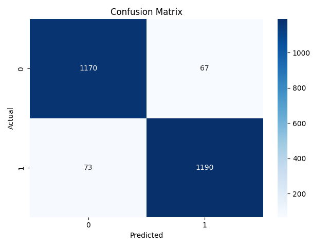

#### 14B. Precision-Recall Curve

**Source Code:**
```python
y_pred_proba = classifier.predict_proba(X_test)[:,1]
precision, recall, thresholds = precision_recall_curve(y_test, y_pred_proba)

fig, ax = plt.subplots()
ax.plot(recall, precision, label='Decision Tree')
ax.set_xlabel('Recall')
ax.set_ylabel('Precision')
ax.set_title('Precision-Recall Curve')
ax.legend()
plt.tight_layout()
plt.show()
```

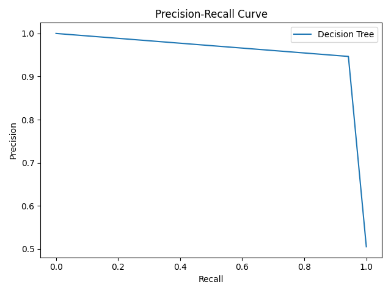

#### 15B. ROC Curve

**Source Code:**
```python
y_pred_proba = classifier.predict_proba(X_test)[:,1]
fpr, tpr, thresholds = metrics.roc_curve(y_test, y_pred_proba)

fig, ax = plt.subplots()
ax.plot(fpr, tpr, label='Decision Tree Classification', color='firebrick')
ax.set_title('ROC Curve')
ax.set_xlabel('False Positive Rate')
ax.set_ylabel('True Positive Rate')
plt.box(False)
ax.legend()
plt.tight_layout()
plt.show()
```

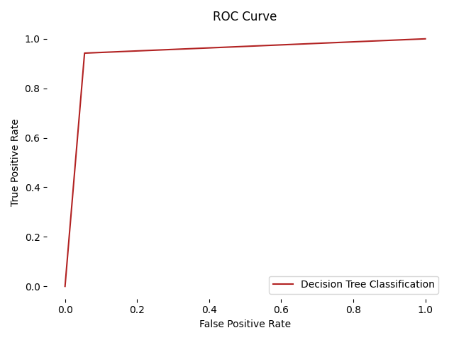

---

### C. Support Vector Machine (SVM)

#### 10C. Training Model

**Source Code:**
```python
classifier = SVC(kernel='linear', random_state=0)
classifier.fit(X_train, y_train)
```

#### 11C. Prediksi

**Source Code:**
```python
y_pred = classifier.predict(X_test)
print(np.concatenate((y_pred.reshape(len(y_pred), 1), y_test.reshape(len(y_test), 1)), 1))
```

#### 12C. Evaluasi Model

**Source Code:**
```python
# Accuracy
print(f"Accuracy : {accuracy_score(y_test, y_pred)}")

# F1 Score
print(f"F1 Score : {f1_score(y_test, y_pred)}")

# Classification Report
print(f'Classification Report: \n{classification_report(y_test, y_pred)}')
```

#### 13C. Confusion Matrix

**Source Code:**
```python
cf_matrix = confusion_matrix(y_test, y_pred)
sns.heatmap(cf_matrix, annot=True, fmt='d', cmap='Blues')
plt.title('Confusion Matrix')
plt.xlabel('Predicted')
plt.ylabel('Actual')
plt.tight_layout()
plt.show()
```

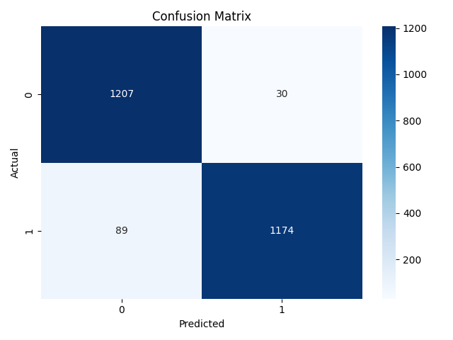

#### 14C. Precision-Recall Curve

**Source Code:**
```python
y_pred_proba = classifier.decision_function(X_test)
precision, recall, thresholds = precision_recall_curve(y_test, y_pred_proba)

fig, ax = plt.subplots()
ax.plot(recall, precision, label='Support Vector Machine')
ax.set_xlabel('Recall')
ax.set_ylabel('Precision')
ax.set_title('Precision-Recall Curve')
ax.legend()
plt.tight_layout()
plt.show()
```

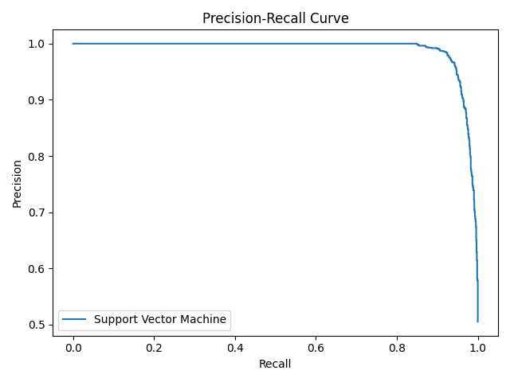

#### 15C. ROC Curve

**Source Code:**
```python
y_pred_proba = classifier.decision_function(X_test)
fpr, tpr, thresholds = metrics.roc_curve(y_test, y_pred_proba)

fig, ax = plt.subplots()
ax.plot(fpr, tpr, label='Support Vector Machine Classification', color='firebrick')
ax.set_title('ROC Curve')
ax.set_xlabel('False Positive Rate')
ax.set_ylabel('True Positive Rate')
plt.box(False)
ax.legend()
plt.tight_layout()
plt.show()
```

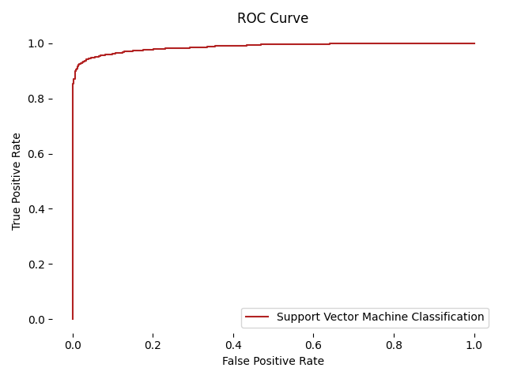

---

## Perbandingan Hasil Evaluasi

| Model          | Accuracy | F1 Score |
|----------------|----------|----------|
| Naive Bayes    | 0.9176   | 0.9177   |
| Decision Tree  | 0.944    | 0.9444   |
| SVM            | 0.9524   | 0.9517   |

> Dataset ini memiliki fitur yang sangat membedakan kedua kelas (terutama fitur warna `blue`), sehingga ketiga model mampu mencapai akurasi sangat tinggi.

---

## Cara Menjalankan

### Prasyarat
```bash
pip install pandas numpy matplotlib seaborn scikit-learn
```

### Jalankan Program
```bash
# Naive Bayes
python app_nb.py

# Decision Tree
python app_dtree.py

# SVM
python app_svm.py
```

---

## Library yang Digunakan
| Library      | Kegunaan                                  |
|--------------|-------------------------------------------|
| pandas       | Manipulasi dan analisis data              |
| numpy        | Operasi numerik                           |
| matplotlib   | Visualisasi grafik                        |
| seaborn      | Visualisasi statistik                     |
| scikit-learn | Preprocessing, modeling, dan evaluasi     |

---

## Kesimpulan
- Ketiga model berhasil melakukan klasifikasi orange vs grapefruit dengan sangat baik.
- Fitur **warna biru (blue)** memiliki korelasi tertinggi dengan label kelas.
- Untuk dataset ini, **semua model** menunjukkan performa yang sangat baik.
- **Naive Bayes** paling cepat dalam proses pelatihan karena berbasis probabilitas sederhana.
- **Decision Tree** paling mudah diinterpretasikan karena berbasis aturan pohon keputusan.
- **SVM dengan kernel linear** umumnya paling stabil untuk data dengan banyak fitur dan mencari hyperplane optimal.

# Fruit-Clasification
